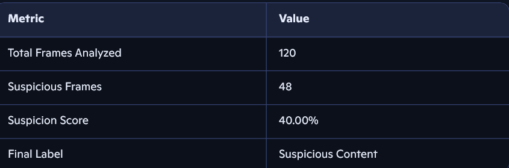

# 🛡️ DeepShield: Real-Time Deepfake Detection Agent

DeepShield is an Agentic AI system designed to detect and explain deepfakes in videos and images. In an age where misinformation spreads faster than truth, DeepShield empowers users to verify visual content before it goes viral.

Built for journalists, citizens, and digital platforms, DeepShield analyzes facial movements, voice patterns, and pixel inconsistencies to flag suspicious media. It doesn’t just say “fake”—it shows why.

---

## 🚀 Features

- Upload videos or images for analysis
- Detect deepfake patterns using facial and audio cues
- Return a confidence score with visual explanations
- Simple web interface built with Streamlit
- Explainable AI: highlights anomalies like lip sync mismatch or unnatural blinking

---

## 🧠 Tech Stack

- Python
- OpenCV
- DeepFace / Deepware API
- Streamlit (UI)
- FaceForensics++ (optional dataset)

---

## 📦 Folder Structure


## 🚧 Known Limitations

- DeepShield may not reliably detect fully AI-generated videos with synthetic faces.
- Detection accuracy is lower for AI-generated child faces due to limited training data and subtle features.
- Lip-sync and audio inconsistencies are not yet analyzed.
- Metadata and artifact-level analysis are planned for future versions.

## 🔮 Future Improvements

- Integrate pretrained deepfake classifiers (DFDC, FakeAVCeleb)
- Add lip-sync and audio-visual mismatch detection
- Include metadata and artifact analysis
- Improve detection of synthetic child faces using shape and texture cues
## design.html
```
<!DOCTYPE html>
<html>
<head>
  <style>
    body {
      font-family: 'Segoe UI', sans-serif;
      background-image: url("assets/background.png");
      background-size: cover;
      background-position: center;
      background-repeat: no-repeat;
      color: #fff;
      text-align: center;
      padding: 20px;
      background: #222e50; /* deep blue */
    }

    .radial-meter {
      width: 120px;
      margin: 20px auto;
    }

    .circle-bg {
      fill: none;
      stroke: #444;
      stroke-width: 3.8;
    }

    .circle {
      fill: none;
      stroke: #4CAF50;
      stroke-width: 2.8;
      stroke-linecap: round;
      stroke-dasharray: __STROKE_DASHARRAY__, 100;
    }

    .percentage {
      fill: #fff;
      font-size: 0.7em;
      text-anchor: middle;
      filter: drop-shadow(0 0 4px #222);
    }

    .label {
      font-size: 1.4em;
      margin-top: 10px;
      color: #fff;
      background: rgba(0, 0, 0, 0.8); /* dark, highly visible */
      padding: 8px 24px;
      border-radius: 8px;
      display: inline-block;
      filter: drop-shadow(0 0 4px #222);
    }

    .result {
      background: rgba(0,0,0,0.85); /* dark, highly visible */
      color: #fff;                  /* white text */
      padding: 12px 24px;
      border-radius: 12px;
      font-size: 1.2em;
      margin: 16px auto;
      display: inline-block;
    }
  </style>
</head>
<body>

  <div class="radial-meter">
    <svg viewBox="0 0 36 36">
      <path class="circle-bg" d="M18 2.0845 a 15.9155 15.9155 0 0 1 0 31.831 a 15.9155 15.9155 0 0 1 0 -31.831"/>
      <path class="circle" d="M18 2.0845 a 15.9155 15.9155 0 0 1 0 31.831 a 15.9155 15.9155 0 0 1 0 -31.831"/>
      <text x="18" y="20.35" class="percentage">__PERCENTAGE__%</text>
    </svg>
  </div>

  <div class="label">__LABEL__</div>

 

</body>
</html>

```
## app.py
```
import os
os.environ['TF_CPP_MIN_LOG_LEVEL'] = '2'

import streamlit as st
from PIL import Image
from detector import detect_deepfake
import base64
import io


# Load and encode background image
with open("assets/background.png", "rb") as image_file:
    encoded_string = base64.b64encode(image_file.read()).decode()

st.set_page_config(page_title="DeepShield", page_icon="🛡️", layout="wide")

st.title("🛡️ DeepShield: Real-Time Deepfake Detection Agent")
st.markdown("DeepShield helps you detect and explain deepfakes in videos. Upload a video file, and our AI agent will analyze it for signs of manipulation.")

video_file = st.file_uploader("📤 Upload a video file", type=["mp4", "mov", "avi"])

if video_file is not None:
    with open("sample.mp4", "wb") as f:
        f.write(video_file.read())

    with st.spinner("🔍 Analyzing video... Please wait."):
        result = detect_deepfake("sample.mp4")

    score = result['score']
    label = result['label']
    stroke_dasharray = int(score * 0.72)

    with open("design.html", "r", encoding="utf-8") as f:
        html = f.read()
        html = html.replace("__PERCENTAGE__", f"{score:.2f}")
        html = html.replace("__STROKE_DASHARRAY__", str(stroke_dasharray))
        html = html.replace("__LABEL__", label)
        st.markdown(html, unsafe_allow_html=True)

    st.success(f"Result: {label} ({score:.2f}%)")
    st.markdown(f"🔍 Analyzed {result['total_frames']} frames, flagged {result['suspicious_frames']} as suspicious.")

else:
    stroke_dasharray = int(72 * 0.72)
    with open("design.html", "r", encoding="utf-8") as f:
        html = f.read()
        html = html.replace("__PERCENTAGE__", "72")
        html = html.replace("__STROKE_DASHARRAY__", str(stroke_dasharray))
        html = html.replace("__LABEL__", "Awaiting upload...")
        st.markdown(html, unsafe_allow_html=True)

st.markdown(f"""
    <style>
    .stApp {{
        background-image: url("data:image/jpeg;base64,{encoded_string}");
        background-size: cover;
        background-position: center;
        background-repeat: no-repeat;
    }}
    </style>
""", unsafe_allow_html=True)

st.markdown("---")
st.caption("Built by DHINESH and team • Agentic AI for truth and transparency")

```
## Sample Output


## Result
DeepShield analyzes video frames using facial attribute detection to identify signs of synthetic manipulation. It evaluates each frame for anomalies in emotion, age, and gender, then calculates a suspicion score to classify the video.
🔍 Detection Labels:
• 	Likely Deepfake: Suspicion score > 60%
• 	Suspicious Content: Suspicion score between 30–60%
• 	Authentic: Suspicion score < 30%

